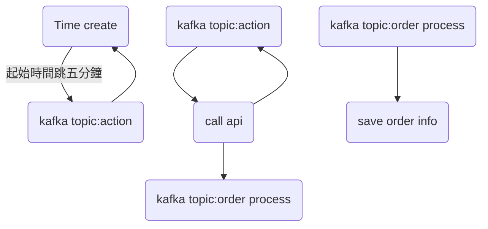
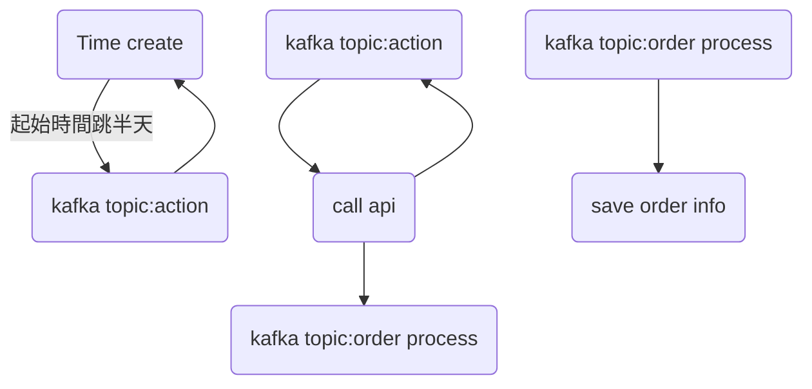
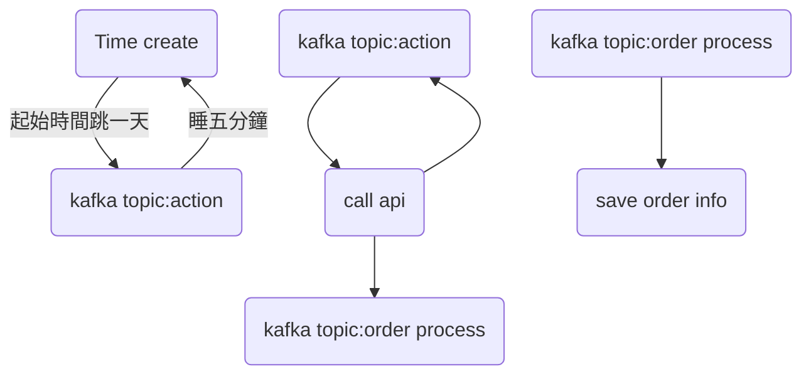

[toc]

## 2022/02月的某一天
### 事起源由
我們有一個需求是需要回滾資料，讓User可以拿到過去的訂單當作"鋪底"，討論的結果是，因為現在的做法就是按照5分鐘一次的往前打訂單，那我們是否只要一定的時段 一步一步的往前切就好。然後就這樣做了


### 解決方法
因2022/08/12 這一隻也發生了另一個狀況
因此把解決方法也記錄在這

當時的解決第一步，是針對回滾的時間間閣拉長，原本是每隔五分鐘的時間差把時間切斷丟進Queue裡面，讓程式做，這個時長改成半天，變成了步進半天半天的方式快速的把回滾區間產出Queue去做處理

後來8/12上正式區跑回滾30天發生一個情況，客戶真實的訂單量非常的大，平台的API有分頁，因此回滾的時候異常耗時，甚至時常Timeout，一種是平台那邊拉的訂單量過大，另一個部分是我方正式區兩個Job機同時間收到大量的Queue要去問訂單，當時甚至有幾個平台開了三個Job機，導致Error更是嚴重，面臨不知道眾多的queue中那些是成功的，那些是失敗的，所幸大概回滾10天後，幾乎所有平台都把我們Ban掉了，所以不用擔心了。

因此需要解決第二步，大量一次性的把所需要的訂單時段切開丟進Queue裡，造成的問題是崩潰的，這一部分後來改成一次步進一天，然後五分鐘後再步進第二天，雖然整體完成的時間會拉長，但是這樣放緩可以確保Queue正常不會被塞住，而且平台也不會被打到server error導致資料不一致。

同樣回滾30天造成的狀況
|  |原始  |2月後  |8月後|
| -------- | -------- | -------- |---|
|作法 |把三十天的時間切開<br>每隔五分鐘產一個queue|把三十天的時間切開<br>每隔半天產一個queue|把三十天的時間切開<br>每隔一天產一個queue<br>並且每隔五分鐘把這個queue打進kafka|
|總Queue的量(工作量) |60/5 * 24 * 30=8640|30 * 2=60|30|
|假設每一個工作產生100張訂單 |864000|6000|3000|
|Queue的工作量工作所需的時間(打API假設2秒) |8640*2= 17280|60*2=120|30*5*60=9000|
|此方案最嚴重的問題 |巨量的Queue根本做不完<br>且時常會暴力打到平台端Error|大量的Queue 可以做完<br>但是會短時間塞住<br>導致其他正常工作無法運作<br>|所需時間長|


### 當時狀況
我們就按照時間每隔五分鐘(不是真的等五分鐘，而是時間無窮的切)就發散一個Queue給kafka了，也就是說一天有
60*24/5=288  (一天有288個queue)  30天就會瞬間壓了八千多個Queue進入kafka
這個Queue相對應的comsumer是去打平台取得訂單，下一步就是將訂單收整到我們的平台裡，所以 下一步就是打將近300張訂單資料去下一個queue處理，因為回滾訂單幾乎都是已完成訂單居多，在設定的時間內，幾乎都是兩三百張訂單

假設情況

|  | 待出貨 | 處理中 |已出貨 |已完成 |取消 |退貨 |
| -------- | -------- | --- |--- |--- |--- |--- |
| 正常狀況     | 50 |0  |200  |300  |25  |30  |
| 回滾狀況     | 0 |0  |0  |800  |25  |50  |

也就是說 回滾的狀況下
訂單會龐大且集中在某些狀況下


### 總結問題
剛開始做完的時候並不覺得有任何問題<br>
但是後續出現兩次問題<br>
一次是大量幾乎相同多餘的queue，造成job的資源浪費  
一次是大量的queue幾乎在同一時間被多台消化造成server端的error

### 奇聞軼事
當時對於kafka跟queue之間的關係，還有Job機之間不太會看lag造成的影響，
以為Job上了以後就會是現在的程式邏輯處理方法，但是實際上，因為我塞入queue的資料就是下一個comsumer要處理的資料，所以我改得當下，還要等之前的邏輯處理完才是現在的。


當時情況是

第一版的實測悲劇

30天回滾的訂單配上五分鐘一次+每一次都300張完成訂單


打action的queue 馬上飆到**8640**個queue，打平台後馬上變**250萬**的訂單等待處理，但是當時處理的Job有點問題，我一直更新Job但是程式碼要等order process處理完才知道，而且要處理完畢需要等這**250萬**筆資料處理完才可以處理我修改後的。

當時因為不熟，所以一直~~上板+重拉~~，導致action的queue衝到快**2萬**個卡住的queue ，差點導致後面的order process會產生**600萬**個queue，幸好當下立刻寫了一個job 把後面產生的action queue都是拿了就立刻丟掉的方式，快速處理，但是就算是這樣，也是開了多隻job+9小時才把這個塞住的queue處理掉。


後改成


2022/08/12這版也發生了一個悲劇

雖然時間間閣拉開成半天，但是還是會在瞬間產生大量的不同時間的打訂單需求queue去action的topic中，配上正式區跟測試區不同，測試區只有**一台**機器，所以多少需求來都是一個一個處理，正式區有**2台以上的job機**，從我們這邊打向平台的動作更密集，加上我~~手賤~~想12點前做完，改成了4台，8點以後就被ban了，後面將近8成的訂單API請求，都被平台ban掉了，根本無法取得訂單，因此改成了下一版


經過8月12後改成



### 此經驗的重點
kafka的queue內容在這裡 <br>
如果是整張訂單直接塞入資料庫候傳ID<br>
會造成DB的大量IO跟查詢進出<br>
透過傳queue的方式可以減低大量的IO並且如果要用訂單資料做其他處理<br>
也可以透過外掛comsumer group 的方式copy走資料去應用<br>
但是因為這邊丟的資料是整份的資料而不是只有ID<br>
也造成上面說的程式改了要等到前面的處理完了 邏輯才會走新的<br>

## 2022/08/04 
### 事起源由
8/4早上塞入了大量rollback的蝦皮queue資料
但是完全沒有消除的跡象，but訂單卻有近來
形成一種queue沒有消除 但是資料確有近來的詭異現象

### 解決方法
把取queue的數量，從一次拿10個，改成一次拿2個

### 當時狀況
#### Kafka
針對整個去打平台的group 都是在"Stable"的狀況

#### Job機
兩個都是綠燈 正常運作，也沒有發出任何錯誤信件出來

**看起來一切良好**

### 深入了解後發現幾個狀況
#### job機有拉 有跑但是沒有commit成功
 
 ```
 2022-08-04 03:10:44.933 ERROR 8 --- [       Thread-2] o.a.k.c.c.internals.ConsumerCoordinator  : [Consumer clientId=consumer-call-api-to-get-data-1, groupId=call-api-to-get-data] Offset commit with offsets {action-to-shopee-56=OffsetAndMetadata{offset=964, leaderEpoch=23, metadata=''}, action-to-shopee-23=OffsetAndMetadata{offset=906, leaderEpoch=22, metadata=''}, action-to-shopee-52=OffsetAndMetadata{offset=929, leaderEpoch=22, metadata=''}, action-to-shopee-19=OffsetAndMetadata{offset=874, leaderEpoch=25, metadata=''}, action-to-shopee-2=OffsetAndMetadata{offset=916, leaderEpoch=22, metadata=''}, action-to-shopee-31=OffsetAndMetadata{offset=853, leaderEpoch=17, metadata=''}, action-to-shopee-60=OffsetAndMetadata{offset=799, leaderEpoch=35, metadata=''}, action-to-shopee-27=OffsetAndMetadata{offset=859, leaderEpoch=19, metadata=''}, action-to-shopee-10=OffsetAndMetadata{offset=902, leaderEpoch=27, metadata=''}, action-to-shopee-39=OffsetAndMetadata{offset=885, leaderEpoch=25, metadata=''}, action-to-shopee-6=OffsetAndMetadata{offset=951, leaderEpoch=22, metadata=''}, action-to-shopee-35=OffsetAndMetadata{offset=879, leaderEpoch=31, metadata=''}, action-to-shopee-18=OffsetAndMetadata{offset=873, leaderEpoch=28, metadata=''}, action-to-shopee-47=OffsetAndMetadata{offset=898, leaderEpoch=19, metadata=''}, action-to-shopee-14=OffsetAndMetadata{offset=922, leaderEpoch=28, metadata=''}, action-to-shopee-43=OffsetAndMetadata{offset=880, leaderEpoch=22, metadata=''}, action-to-shopee-57=OffsetAndMetadata{offset=898, leaderEpoch=27, metadata=''}, action-to-shopee-24=OffsetAndMetadata{offset=890, leaderEpoch=29, metadata=''}, action-to-shopee-53=OffsetAndMetadata{offset=909, leaderEpoch=33, metadata=''}, action-to-shopee-20=OffsetAndMetadata{offset=871, leaderEpoch=36, metadata=''}, action-to-shopee-32=OffsetAndMetadata{offset=899, leaderEpoch=22, metadata=''}, action-to-shopee-61=OffsetAndMetadata{offset=942, leaderEpoch=27, metadata=''}, action-to-shopee-28=OffsetAndMetadata{offset=900, leaderEpoch=27, metadata=''}, action-to-shopee-40=OffsetAndMetadata{offset=894, leaderEpoch=35, metadata=''}, action-to-shopee-7=OffsetAndMetadata{offset=989, leaderEpoch=19, metadata=''}, action-to-shopee-36=OffsetAndMetadata{offset=868, leaderEpoch=23, metadata=''}, action-to-shopee-3=OffsetAndMetadata{offset=862, leaderEpoch=22, metadata=''}, action-to-shopee-48=OffsetAndMetadata{offset=2514, leaderEpoch=27, metadata=''}, action-to-shopee-15=OffsetAndMetadata{offset=952, leaderEpoch=31, metadata=''}, action-to-shopee-44=OffsetAndMetadata{offset=884, leaderEpoch=29, metadata=''}, action-to-shopee-11=OffsetAndMetadata{offset=883, leaderEpoch=17, metadata=''}, action-to-shopee-58=OffsetAndMetadata{offset=870, leaderEpoch=28, metadata=''}, action-to-shopee-25=OffsetAndMetadata{offset=923, leaderEpoch=32, metadata=''}, action-to-shopee-54=OffsetAndMetadata{offset=964, leaderEpoch=28, metadata=''}, action-to-shopee-21=OffsetAndMetadata{offset=827, leaderEpoch=27, metadata=''}, action-to-shopee-33=OffsetAndMetadata{offset=886, leaderEpoch=33, metadata=''}, action-to-shopee-0=OffsetAndMetadata{offset=927, leaderEpoch=35, metadata=''}, action-to-shopee-62=OffsetAndMetadata{offset=870, leaderEpoch=23, metadata=''}, action-to-shopee-29=OffsetAndMetadata{offset=877, leaderEpoch=34, metadata=''}, action-to-shopee-41=OffsetAndMetadata{offset=911, leaderEpoch=27, metadata=''}, action-to-shopee-8=OffsetAndMetadata{offset=951, leaderEpoch=27, metadata=''}, action-to-shopee-37=OffsetAndMetadata{offset=880, leaderEpoch=27, metadata=''}, action-to-shopee-4=OffsetAndMetadata{offset=846, leaderEpoch=30, metadata=''}, action-to-shopee-49=OffsetAndMetadata{offset=917, leaderEpoch=34, metadata=''}, action-to-shopee-16=OffsetAndMetadata{offset=988, leaderEpoch=23, metadata=''}, action-to-shopee-45=OffsetAndMetadata{offset=885, leaderEpoch=33, metadata=''}, action-to-shopee-12=OffsetAndMetadata{offset=851, leaderEpoch=22, metadata=''}, action-to-shopee-26=OffsetAndMetadata{offset=898, leaderEpoch=22, metadata=''}, action-to-shopee-55=OffsetAndMetadata{offset=986, leaderEpoch=31, metadata=''}, action-to-shopee-22=OffsetAndMetadata{offset=849, leaderEpoch=22, metadata=''}, action-to-shopee-51=OffsetAndMetadata{offset=820, leaderEpoch=17, metadata=''}, action-to-shopee-34=OffsetAndMetadata{offset=957, leaderEpoch=28, metadata=''}, action-to-shopee-1=OffsetAndMetadata{offset=803, leaderEpoch=27, metadata=''}, action-to-shopee-63=OffsetAndMetadata{offset=905, leaderEpoch=22, metadata=''}, action-to-shopee-30=OffsetAndMetadata{offset=924, leaderEpoch=27, metadata=''}, action-to-shopee-59=OffsetAndMetadata{offset=923, leaderEpoch=25, metadata=''}, action-to-shopee-42=OffsetAndMetadata{offset=980, leaderEpoch=22, metadata=''}, action-to-shopee-9=OffsetAndMetadata{offset=954, leaderEpoch=35, metadata=''}, action-to-shopee-38=OffsetAndMetadata{offset=925, leaderEpoch=28, metadata=''}, action-to-shopee-5=OffsetAndMetadata{offset=913, leaderEpoch=33, metadata=''}, action-to-shopee-50=OffsetAndMetadata{offset=902, leaderEpoch=27, metadata=''}, action-to-shopee-17=OffsetAndMetadata{offset=885, leaderEpoch=27, metadata=''}, action-to-shopee-46=OffsetAndMetadata{offset=918, leaderEpoch=22, metadata=''}, action-to-shopee-13=OffsetAndMetadata{offset=851, leaderEpoch=33, metadata=''}} failed

org.apache.kafka.clients.consumer.CommitFailedException: Offset commit cannot be completed since the consumer is not part of an active group for auto partition assignment; it is likely that the consumer was kicked out of the group.
 at org.apache.kafka.clients.consumer.internals.ConsumerCoordinator.sendOffsetCommitRequest(ConsumerCoordinator.java:1139) ~[kafka-clients-2.8.1.jar!/:na]
 at org.apache.kafka.clients.consumer.internals.ConsumerCoordinator.doCommitOffsetsAsync(ConsumerCoordinator.java:957) ~[kafka-clients-2.8.1.jar!/:na]
 at org.apache.kafka.clients.consumer.internals.ConsumerCoordinator.commitOffsetsAsync(ConsumerCoordinator.java:924) ~[kafka-clients-2.8.1.jar!/:na]
 at org.apache.kafka.clients.consumer.KafkaConsumer.commitAsync(KafkaConsumer.java:1561) ~[kafka-clients-2.8.1.jar!/:na]
 at org.apache.kafka.clients.consumer.KafkaConsumer.commitAsync(KafkaConsumer.java:1529) ~[kafka-clients-2.8.1.jar!/:na]
 at org.apache.kafka.clients.consumer.KafkaConsumer.commitAsync(KafkaConsumer.java:1506) ~[kafka-clients-2.8.1.jar!/:na]
 at com.systex.oneec.consuming.action.job.init.MainManager.run(MainManager.java:84) ~[classes!/:na]
 at java.base/java.lang.Thread.run(Thread.java:833) ~[na:na]
 ```
 
#### 重新刪除job機後一些狀況
1. kafka 進入 
   1. Preparing Rebalance 狀態
   2. Completing Rebalance 狀態
   3. stable狀態 
   4. Preparing Rebalance 狀態
   5. stable狀態 
2. 同時進入job機看 會出現這一個訊息
```
 [Consumer clientId=consumer-call-api-to-get-data-1, groupId=call-api-to-get-data] Attempt to heartbeat failed since group is rebalancing
```
3. 然後comsumer數量就減少了，但是步驟5的時後又加回來了
**此狀況是有點異常，因為正常的kafka應該進入到3後不應該再回到4，而且走到5**

#### 再次仔細觀察+回想場景
1. code沒變 昨天正常沒道理今天不正常
2. 差異點 今天是吃回滾資料
3. 回滾資料有什麼特殊的
4. 回滾資料會把已完成的訂單完全拉回來+財務資料
5. 然後這樣需要多少時間呢
6. 經驗證 已完成的訂單時間拉10天左右 將近三百張訂單 蝦皮有訂單數量一次請求的上限
7. 外加都要打財務資料
8. 一次queue的總時間將近一分鐘


一次queue所花的時間將近1分鐘<<這個是重點 紀錄一下

然後我們跟kafka的timeout時間吃的是預設(5分鐘) ，並且拉了10個queue來做處理，避免麻煩

問題就在這裡發生了

10個queue 每一個1分鐘 我做完需要10分鐘
但是kafka 5分鐘就認為我死了，把我剔除group
因此我回壓commit的時候無法回壓
取的queue沒有更新 就再次動作

### 總結問題
1. queue的數量*一個queue所需的時間 在某些場景下 太久 造成kafka認定死亡
2. commitasync導致我queue認定正常工作

一句話就是 job機跟kafka註冊 拿了工作，但是做太久，沒有再去拿下一批JOB，kafka就把他刪除了

### 可處理的方法
1. 不可能針對commitasync處理
2. 減低一次取的queue的量
3. 減少queue裡面所需要網外打API的工作(減少時間)
4. 拉高comsumer的timeout時間

### Kafka 狀態表


|  | Column 2  |
| -------- | --------  |
| Stable     | Consumer group has members which have been assigned partitions |
| Completing Rebalance     | Kafka is assigning partitions to group members|
| Preparing Rebalance     | A reassignment of partitions is required, members have been asked to stop consuming|
| Empty     | Consumer group exists, but does not have any members|
| Dead     | Consumer group does not have any members and it's metadata has been removed|
| Unknown     | Group state is not known|


### 此經驗的重點
queue 要評估他做一個所需要的時間  
來判斷一次取的最大量  
如果無法評估 要把工作盡量拆到最小可評估單位


### 參考資料
1. https://stackoverflow.com/questions/40162370/heartbeat-failed-for-group-because-its-rebalancing
2. https://stackoverflow.com/questions/39730126/difference-between-session-timeout-ms-and-max-poll-interval-ms-for-kafka-0-10/39759329#39759329


## 2022/09/29
### 事起源由

User下訂單後要出貨 但是發動了兩次的一模一樣的取號JOB導致後面取號產生一個成功 一個錯誤的問題
### 導致原因

巡邏檢查三秒一次大量打QUEUE 配合後面的JOB機有兩台
同時兩台機器消化了兩個一模一樣的JOB

### 解決方法
打QUEUE的時候指定Partition key

### 總結問題
這個問題在極度大量又配合多台機器而且同一個QUEUE跟QUEUE之間沒有其他的QUEUE插進來就會因為分散，另外JOB內的邏輯屬於有先後狀態的問題，因此產生
### 可處理的方法
1. 在做之前做快取跟LOCK檢查
2. 打QUEUE的時候指定PARTITION Key 使其唯一
### 處理方法的優劣
1. 還是無法解決多台處理同一個QUEUE的時候在非常極限的狀況下還是有可能碰撞的情況，而且因為LOCK 導致速度拖慢
2. 從某些極致的情況或是邏輯的情況下 會使大量的同一個檢查的LOGIC JOB大量塞到同一個Partition 

### 此經驗的重點
partition key 設定的重點

如果設定為null 他會自動分散 但是相關comsumer程式就必須要是無狀態的
如果需設定，他就變有序 comsumer必須要針對有序來做相對應處理

