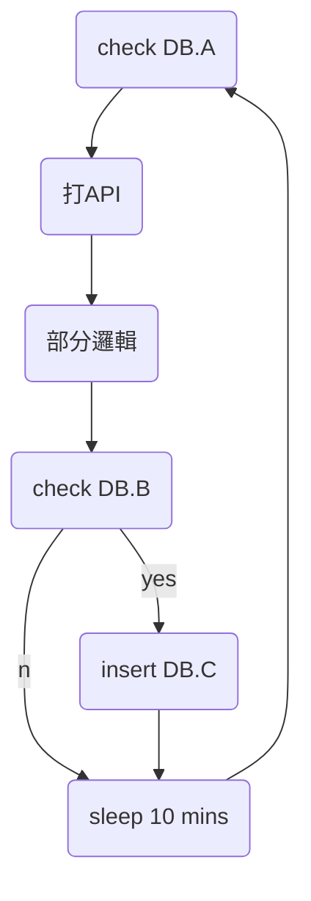

[toc]

## 大名詞介紹
1. Producer：訊息生產者
2. Broker：傳遞訊息的中介者
3. Consumer：訊息消費者
4. Topic：訊息的主題
5. Partition：主題內的分區


### Producer
只要是發送訊息出去的都是這一個腳色，定位上是往kafka push queue的就是。
### Broker
保存並且接受訊息的實體，同時也負起訊息的備份跟index等等的腳色。
多個broker內可以有多個Topic進行備份或是調整空間
有可能 A Topic同時在 第一個Broker跟第三個broker內


### Comsumer
消化訊息者，只要是從kafka拉訊息去處理邏輯的都是。
注意:Comsumer 可能同時成為Producer，完全看你的邏輯處理如何handle

### Topic
設定主題，讓你的訊息往這裡走，讓producer跟comsumer有同一個聚焦點


### Partition
一個topic內可以有多個partition，使資料達到分散又可以有序，partition的數量跟你可以做到多大的分散是有絕對的關係。
:::info
一個topic (前提 partition key 分散的很均勻)
如果有5個partition
那最多可以讓5個comsumer同步消化工作

如果有100個partition
最多可以讓100個comsumer同步消化工作
:::

:::warning
注意 如果有需要順序性處理的queue，那就必須要用key 強制鎖在同一個partition中，讓他一個一個消化。
反之 如果不需要順序性處理的就可以把key 設定null 讓他自動隨機，達到多comsumer的效益。

同時要注意你comsumer程式的內容，如果兩隻同時拿到一模一樣內容的queue有沒有關係，如果有關係，請設定key 讓他走同一個partition。
:::


### ComsumerGroup
這個相對還好，只是讓一份資料給不同的comsumer各自帶不同的ComsumerGroupid來拿走一樣的資料。

觀念像是同一個group的就會按照順序一個一個給 從0 1 2 3 4 5
增加一個comsumer他也只是從6開始

但是如果增加一個不同groupId的comsumer 他就會從0開始

:::warning
如果資料量很多，會根據設定的保存時間或是大小來自動丟棄最前面的
所以有可能會變成從2開始
:::


## 舉個例子


假設原有一支JOB 每10分鐘，迴圈檢查DB某張表(A表)，然後這個JOB要再查API+部分邏輯+查第二個表(B表)後組合成為新資料塞回資料庫的另一張表(C表)


:::info
當 DB.A的量或是DB.B的量開始增加的時候
這個JOB所需要的時間就開始難以掌握
因此 這個JOB 如果透過kafka可以這樣改
:::

三隻程式 
1. 睡眠10分鐘
2. 檢查DB.A 並且打入Kafka
3. 查API+部分邏輯+查第二個表(DB.B表) 確定要塞入的才寫入
:::success
第一隻的定位是純producer
他的角色就是定時去發動一件事情

第二隻的定位是comsumer+producer
他是接續第一隻的消化者同時去檢查資料庫有多少下一階段工作要做的給第三隻的producer

第三隻的定位就是純comsumer
他的工作就是把邏輯處理乾淨


如此DB.A的量大時
只要comsumer增大就可 消化時間也可控
(只要確定每一隻comsumer正常的消化速度 幾個queue/s)
:::


## 基本所需參數

### producer
```
bootstrap.servers
key.serializer
value.serializer
linger.ms
batch.size
buffer.memory
compression.type
max.in.flight.requests.per.connection
request.timeout.ms
delivery.timeout.ms
acks
retries
```

除此之外
topic ,partition  key , value 也是重要producer必須


### comsumer

``` 
bootstrap.servers
group.id
key.serializer
value.serializer
max.poll.records
enable.auto.commit
max.poll.interval.ms
```
除此之外
topic 也是重要comsumer必須

:::warning
max.poll.records<最大一次取得的量
如果取得的量過大，可能會造成整體時間過長進而因為 max.poll.interval.ms
導致Kafka 認為這個comsumer已經沒有下文了 他會自動進行rebalance
把現在的partition-comsumer之間重新安排

另外enable.auto.commit 這個參數 如果設定ture，取過的queue就會自動commit 下一次就會無法取得，因此這一個參數強烈建議false 然後程式內確定做完才壓commit，也就是"手動"commit，但是如果是搞丟的queue也不影響的，這種就可以設定自動commit。

:::
:::danger
comsumer 有一種模式 可以指定partition ，也就是說 可以指定要partition 1 這條裡面的queue ，但是這樣缺點眾多，後續擴充或是增減機器，kafka要做rebalance的時候也相對麻煩，因此不建議
:::

## Topic監控（Kowl）
### 此topic有三個comsumer 

這個topic的狀態

現在這topic-comsumer的狀態(代表所有的partition都有comsumer)

comsumer 1 with lag
partition (48,62,66,79,43 個別有 8,6,6,4,3個queue等待處理)

還在topic中的queue總數量


## 最終結果
這張是kafka的logo 也就是kafka的精神
中間的大圈圈 就是Kafka的各種Topic ，周圍就是各種comsumer跟producer


## （選擇）實務坑
https://hackmd.io/@2GrxaqznSJKLrhmXwCaeug/BkCFYgYa9


## （選擇）參考資料
[各重要參數](https://medium.com/@hsiehjenhsuan/kafka-%E5%8F%83%E6%95%B8%E8%A7%A3%E6%9E%90-f1a81f509a16)

[設定參數](https://blog.51cto.com/u_15320818/4908471)

[官方文章](https://kafka.apache.org/documentation/#consumerconfigs_max.poll.interval.ms)
