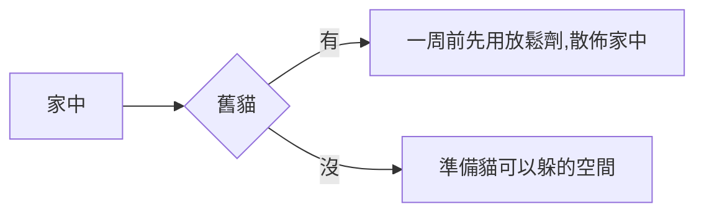
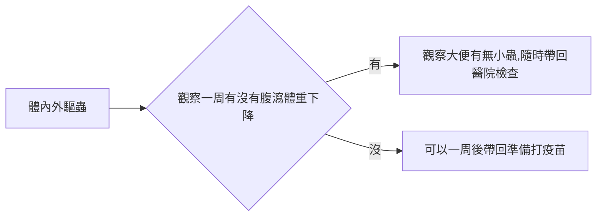
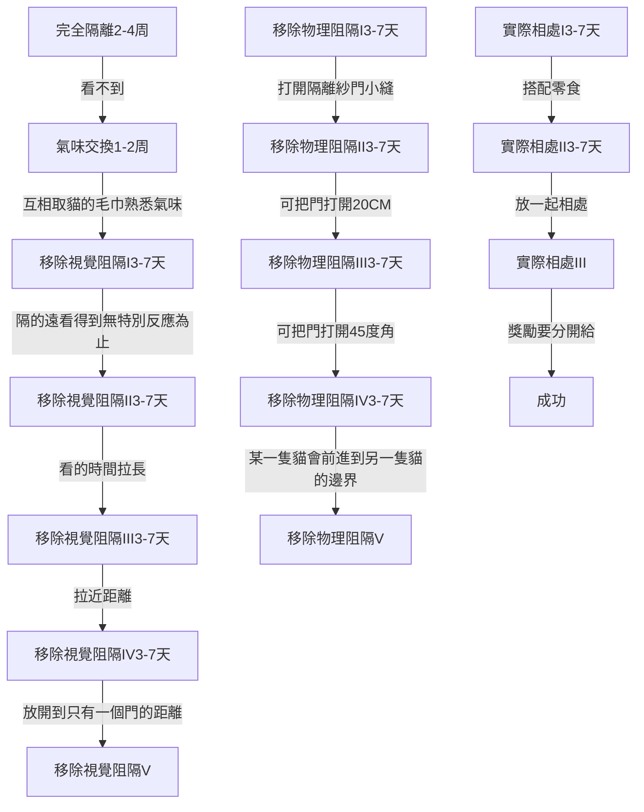

[toc]
## 妹妹

| 日期 | pic | 備註 |
| -------- | -------- | -------- |
| 2022/10/18     |      | 新地毯 GET     |

### 起始紀錄
### 醫療紀錄
### 主費用紀錄
### 健康紀錄

## 小胖胖

| 日期 | pic | 備註 |
| -------- | -------- | -------- |
| 2022/10/14     |      | 剛來的時候躲起來的樣子     |
| 2022/10/15     |      | 看醫生的時候     |
| 2022/10/18     |      | 抓起來看     |

### 起始紀錄
2022/10/14 晚上七點在門外聽到聲音，因門未關衝入後請激動抓，並於隔日去做體內外驅蟲，而後飼養納編，並於當日定名小胖胖 估計兩個半月，也就是十週，有一個成牙，反推生日為2022/08/01

### 醫療紀錄
| 日期 |  事件 |費用 |預約|
| -------- | -------- | -------- |--- |
| 2022/10/15      |   體內外驅蟲   | 400     |:heavy_check_mark:|
| 2022/10/21      |   三合一疫苗   |    600+1800  |:heavy_check_mark:|
| 2022/11/21      |   4合一疫苗   |      | :white_check_mark: |
| 2022/12/21      |   4合一疫苗   |      |:white_check_mark:

### 主費用紀錄
| 日期 | 費用 | 備註 |
| -------- | -------- | -------- |
| 2022/10/15      | 400     | 體內外驅蟲     |
| 2022/10/15      | 1850     | 幼貓飼料 超越     |
| 2022/10/17      | 286     | 貓抓板+貓草水培     |
| 2022/10/21      | 600+1800     | 疫苗+魚油     |

### 健康紀錄

| 日期 | 體重 | 備註 |
| -------- | -------- | -------- |
| 2022/10/15      | 0.9     | 初次醫院檢查     |
| 2022/10/21      | 1.1     | 打針(3合一疫苗)     |

## 訓貓紀錄
事前準備

貓檢查身體

## 親訓
### 方法
:::info
比較推薦：逐步漸進的方法
先建立貓咪安全感與核心領域。大部分的貓咪循這個途徑，乍看之下進度緩慢，但最後反而比較快開始親人、也比較安心。可以使用三層籠或是一個房間放置貓咪，優先推薦房間，對貓更友善，提供安全的躲藏處（如衣櫃、紙箱）、食物、水、貓砂。在貓咪逐漸適應環境之後（建議至少2-4週）再開始訓練拉近距離等。
:::
 
:::danger
比較不推薦：較強迫式的方法
關籠/包毛巾防止逃跑 + 摸摸（+ 好吃零食）。大約有一到二成左右的貓咪可以依此途徑「馴服」，幼貓的成功率會稍高於成貓。如果是可以用這個方法的貓咪，在幾天到一個月之內，應該會看到明顯進步。這個比例是自己在收容所、中途、TNR共十餘年的經驗，因為目前沒有找到相關文獻資料。跟上述方法差別在於對貓咪的強迫程度較高，且跟洪水法往往就是一線之隔，或是根本就是洪水法。（洪水法：最高程度嫌惡刺激 + 防止貓咪逃跑，是一種台灣目前九成以上親訓者都還在使用，但對貓來說非常不友善的作法）
:::

### 注意的部分
:::info
眼睛
>不張大眼睛直視貓咪，盡量以持續瞇眼或是眼角餘光的方式去看貓咪。可以配合使用緩慢眨眼。

身體姿勢與角度
>避免彎腰籠罩貓咪所在位置，避免正面面對貓咪接近。盡量是側身接近，身體與貓咪保持距離。

手
>接近時避免從貓咪上方靠近，以貼近地面或是在貓咪臉部以下的高度接近。在訓練的過程中依照貓咪的接受程度逐漸拉高，這個急不得～

自己的心情/緊張程度
>您害怕被貓咪抓、咬嗎？自己先深呼吸幾次，平穩心情，再去接近貓咪喔。貓咪可以感受到人類是緊張或是放鬆。

緩慢
>在貓咪所在的附近，做任何動作，都是緩慢的，不要急躁或驚慌。即使是掉了東西，也不要慌張快速地去拾回，一切都是慢慢慢，甚至是呼吸都要慢。

輕聲
>開關籠門，拿放物品，都輕聲，避免突然的聲響。如果要與貓咪講話，也是輕柔低聲。

給貓選擇
>貓咪喜歡被用什麼方式/角度/誰接近？喜歡什麼樣的互動？觀察貓咪對不同的接觸或距離的反應，投其所好地建立關係。貓不覺得有壓力，進度最快。

氣味
>身上味道盡量單純，如果前面剛與這隻貓咪不認識的貓狗互動過，可以清洗手部，甚至是換掉衣服再去與這隻貓咪互動。

距離
>隨時留意自己與貓咪的距離，距離分為「身體與貓的距離」以及「手與貓的距離」，身體距離以方便操作的最遠距離為主，手的距離則是以貓咪會感覺到壓力的距離前幾公分為主。

零食、玩具、貓薄荷
>每次互動或接近，都可以留下一點點零食或其他好東西給貓，不要因為想要直接餵食，侵入貓咪的安全距離。安全距離是由每次良好的互動而自動慢慢減短，不是強迫適應的喔！

::: 
:::success
總結
眼睛瞇眼側視、身體側身保持距離、手從地面靠近不高於貓、心情平穩、緩慢、輕聲、保持一樣的氣味、安全距離持續縮短
:::

### 作法

第一階段：設置環境、建立貓咪安全感
1. 提供多個躲藏處（是貓咪完全躲起來看不到的程度才夠）
2. 不找貓、不看貓、不摸貓
3. 貓如果自己出來了，請務必假裝看不到他。如果盯著看或是視線接觸，貓會覺得很害怕
4. 等！這個階段可能會持續幾天到幾個月，每隻貓咪的狀況不同
5. 這個階段的畢業：貓願意自己出來，覺得外面也很安全，大部分時間不再躲藏

 

第二階段：距離減敏

1. 通常我們建議以「主動獎勵貓靠近到某個距離之內」為最優先執行事項，一開始可以訂兩公尺或三公尺，比較會有機會能夠獎勵。獎勵的零食輕輕拋到貓咪面前，力求動作小，不要嚇到貓咪。當貓咪穩定出現目前指定進度時，則再稍微提高獎勵標準，例如縮短20公分。
2. 如果貓咪願意讓您靠近到比較近，也可以從貓咪願意接受的距離開始，用手或長湯匙放置零食。一開始可以從40～50公分左右的距離開始嘗試，如果貓咪害怕蜷縮/ 非常散曈 / 壓耳朵/ 哈氣/ 低鳴/ 出爪，表示您靠太近，請退後。零食可以使用：ciao魚條、ciao肉泥、日清的懷石貓零食、皇家貓飼料bc34或k36、任何貓咪熱愛的零食。一天可以在不同時段進行數次這樣放置零食的訓練，以不造成貓咪緊張為最高原則。貓咪可以接受目前進度的距離，則拉近3～5公分試試看。
3. 花上很多時間慢慢拉近距離，比起一次就靠太近，讓貓咪崩潰，進度還來得更快。貓咪的信任是很容易一瞬間破滅的。
4. 進步到貓咪願意從手上直接吃掉零食時，可以停留在這個進度數天，因為這是重要的「存檔點」，要讓貓咪確實安心接受用手餵食。後面不小心進度推太快嚇到貓，就是回到這個點重新來過。

第三階段：觸摸減敏

1. 用手指輕觸貓臉頰，隨即給零食。可以接受後，再來是稍微出一點點力摸再給零食。接下來的訓練順序是下巴、耳前、頭頂、耳後。花數天時間慢慢循序漸進讓貓習慣被人類觸摸的感覺，每次觸摸都要與零食配對。
2. 頭部都可以自在接受觸摸後，再來的進度是脖子、背、尾巴前的那塊背部。
3. 如果原本是使用三層籠的話，在這階段可以讓貓出來到房間生活，作法是在籠子外也擺一套食、水、砂、躲藏處，籠門不關，不盯著貓看。避免搬移貓原本的資源。

第四階段：進階（抱、剪指甲等）

1. 未來所有進度，包含訓練抱貓、剪指甲等，都應該比照以上方式，確實執行「微小進度」+「好的獎勵」配對出現。切勿追求一次到位，或趁貓不注意時偷加貓沒有允許的進度（例：偷抱），這樣會讓貓咪失去安全感喔！
2. 如果需要拆步驟教學，可以參考我們的親訓主題課、清潔照護主題課訓練計畫順利的話，您應該要感覺到貓逐漸穩定、放心。如果貓咪越來越沒有安全感，甚至更會出爪、哈氣，表示您的訓練方法有誤，請回到貓咪自在的進度，重新來過。使用錯誤的訓練：貓可能會極害怕、主動攻擊、嚇到大小便失禁、過了數月或數年仍然不親人。

:::success
總結: 
1. 一開始，準備隱藏處，然後不找貓、不摸貓的情況持續到貓不會躲藏願意出來為止
2. 利用零食放手上，測試到貓願意吃完
3. 小進度+獎勵(小進度=動作 獎勵=零食)
:::

### 有兩隻貓的情況下
#### 隔離的重點
 
一、衝突雙方妥善隔離，不要見面
>雙方需要在足以長期生活的條件下隔離，盡量不要使用廁所、籠子、陽台，最低限度建議是有布置過適合貓咪生活的房間。在不好的條件下隔離，會讓那一方貓咪身心健康度一直回不來，當然也不用談下一步的介紹訓練了，因為不會成功。

二、調整雙方身心健康度，提高抗壓性
>身心健康度調整好的話，貓可以是情緒穩定、能夠承受短時間巨大壓力，不會因為一點意外而對彼此徹底翻臉。

三、確認隔離階段結束 才開始「介紹」的訓練
>確認雙方都已經回歸正常身心狀態、也不再在意對方之後，才算是隔離階段結束，可以正式開始進行介紹的訓練。需要將雙方當成不認識的兩隻貓來訓練，千萬別以為他們會顧及過去的情份，而在某個時間點自動和好，貓是幾乎不可能會這樣的。

:::success
總結:
不使用同一個廁所、籠子、陽台，讓兩隻有獨立的空間廁所為優先
::: 
#### 隔離的作法

以房間進行「隔離與介紹」
以下括號內的時間為參考，請以貓咪實際狀態決定訓練進度

1. 完全隔離 (2~4週)
一定要做到「看不到」彼此
盡量做到「聽不到」與「聞不到」，真的無法沒關係
任何一隻貓很受「家裡有另外一隻貓」的影響，而有注意，威嚇等行為，這個步驟就是要持續
雙方都已回歸正常生活作息，情緒與行為也正常，則往下一步前進
2. 氣味交換 (1~2週)
用布輕輕摩擦貓咪臉頰，取得費洛蒙氣味
拿貓咪平常經常睡在上面的布或衣服也可以
拿沾有A貓氣味的布給B貓聞，B聞一兩秒就收起來，三秒內給B零食
跟A也進行一樣的訓練
每天每隻進行1~3回合，每回合約1~5次，次數是看貓咪反應跟耐心決定
一聞到就哈氣或是低鳴，豎毛等，請退回上一步
聞到對方味道，有正面反應，或是放鬆磨蹭手上的布，可以往下一步前進
3. 移除視覺阻隔 I (3~7天) 時間短，距離長
推薦以紗門或是與門同高的安全柵欄進行此步驟，在此步驟打開一般的門，而留下紗門或柵欄是關閉的狀態
雙方距離遠，至少相隔3~5公尺
可以兩人同時訓練，一人在內，一人在外(稍微攔住貓，維持距離)
只有一人的狀況則人類在外，要給零食時往門縫丟 (這個技巧可能要預先練習)
開一般的門的時間很短，打開即可給零食，雙方有注意到彼此繼續給，做10~30秒，就將一般的門關上
如果雙方是一移開視覺阻隔就想要衝上去打個你死我活，請退回上一步
雙方在訓練期間冷靜，無特別反應，或是正向反應，則可以往下一步前進
4. 移除視覺阻隔 II (3~7天) 時間中，距離長
同上，但拉長時間，可以做30秒到2分鐘，中間間歇地給零食
注意貓咪什麼時候開始出現緊張的氣氛，在這之前應該要結束練習
5. 移除視覺阻隔 III (3~7天) 時間中，距離中
同上，但稍微引導貓咪靠近紗門，距離1~2公尺，做30秒到2分鐘
6. 移除視覺阻隔 IV (3~7天) 時間中，距離短
同上，引導貓咪靠近到紗門，只隔著紗門，做30秒到2分鐘
7. 移除視覺阻隔 V (2週) 時間長~無限，距離短
同上，在雙方只隔著一道紗門的情況，可以間歇性地給零食，或是一起吃飯，或是兩人分別陪玩逗貓棒等，時間可以是幾分鐘到幾十分鐘，慢慢拉長到可以一直開著一般的門，關紗門
如果貓咪放鬆地游移在靠近紗門跟稍微遠離紗門的地方，不用強迫貓咪一定要靠近
建議在這個進度停留多幾天到一週，因為在見面時如果不小心進度進太快，就是要回到這個步驟
8. 移除物理阻隔 I (3~7天) 時間短，角度小
到這個步驟，一般的門都不用再關，但紗門要有安全扣等措施，讓貓無法自己推開
稍微打開紗門，打開的角度應該要不足以讓貓出入
打開紗門的同時，雙方要有獎勵
練習時間10~30秒
9. 移除物理阻隔 II (3~7天) 時間中，角度小
同上，拉長時間到30秒~2分鐘
10. 移除物理阻隔 III (3~7天) 時間中，角度中
同上，但門開大到約20公分可出入 (雙方有些緊張可以很快地關起來的程度)
11. 移除物理阻隔 IV (3~7天) 時間中，角度大
同上，門開到45度左右
其中一貓在這個步驟可能會嘗試走到門的另一邊，可用零食把想越界的貓再誘導回他的那一側，或是用身體稍微阻擋。如果雙方都非常放鬆，表示可以進到下一步
12. 移除物理阻隔 V (3~7天) 時間長，角度大
門半開的狀況，練習延長時間
人可以卡在門開著的地方，剛好可以分隔兩貓
可以分別給零食，放飯，玩逗貓棒等，任何很吸引他們注意力的事情都可以
13. 實際相處 I (3~7天) 每天一個時段
如果前面做得很確實，到這步驟應該貓對彼此的感覺是中立到正向
一開始放他們相處時，人一定要在旁邊顧，確定可以了時間才慢慢拉長
每天可以有一個時段是放兩貓出來一起相處，在這個時段要搭配零食或逗貓棒
14. 實際相處 II (3~7天) 人在的時候放在一起相處
到這個步驟就不用再一直獎勵，而是拉長到偶爾獎勵即可
人在的時候放在一起相處，如果有一方開始有點緊張，或是情緒激動，可以慢慢把雙方再隔開 (不要動作很大或很快地去抓貓隔開，對他們是很大的刺激)
15. 實際相處III 全時段開放相處
到這個步驟就是細心維持兩貓關係即可 (可積極獎勵和平相處，作法是在一公尺內沒有緊張或起衝突，雙方都給獎勵，要分開給，不能給在同一處，否則可能會造成衝突)
兩貓應該對彼此不會哈氣，威嚇，或是感到恐懼等等
貓咪之間也許沒有感情特別好，但能夠相敬如賓、保持冷淡的和平相處即可

## 醫療

| 年齡 | 疫苗 | 備註 |
| -------- | -------- | -------- |
| 8~9周     | 三合一、四合一、白血病     |      |
| 12~13周     | 三合一、四合一、白血病     |      |
| 16周~     | 三合一、四合一     |      | 
| 1歲~     | 三合一、四合一、白血病     | 成年     |
| 2歲~     | 三合一、四合一、白血病     |      |
| 3歲~     | 三合一、四合一、白血病     |      |
| 4歲~     | 三合一、四合一、白血病     |      |

P:貓瘟
H:貓病毒性鼻氣管炎
C:貓卡里西病毒感染症
FeLV:貓白血病
Ch:貓披衣菌感染症
R:狂犬病

三合一:CHP
四合一:CHPCh
貓白血病:FeLV
狂犬病不活化:R

## 參考資料
訓貓
https://catchattw.com/2074/
https://catchattw.com/2367/